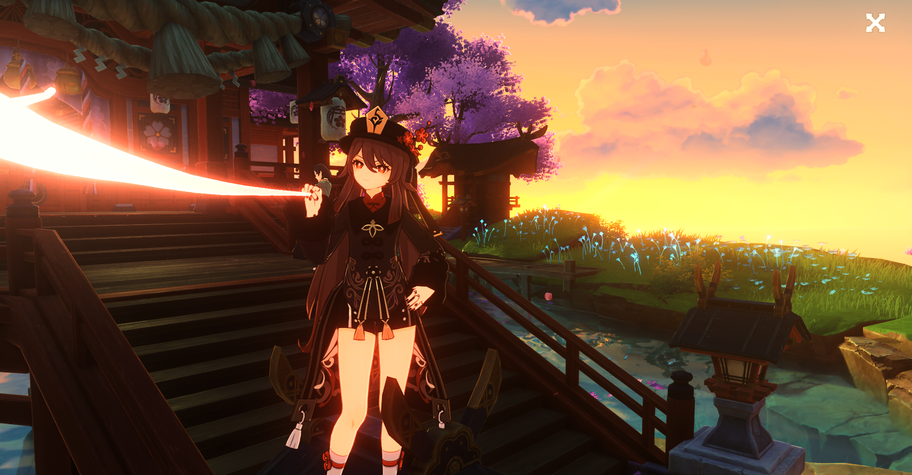
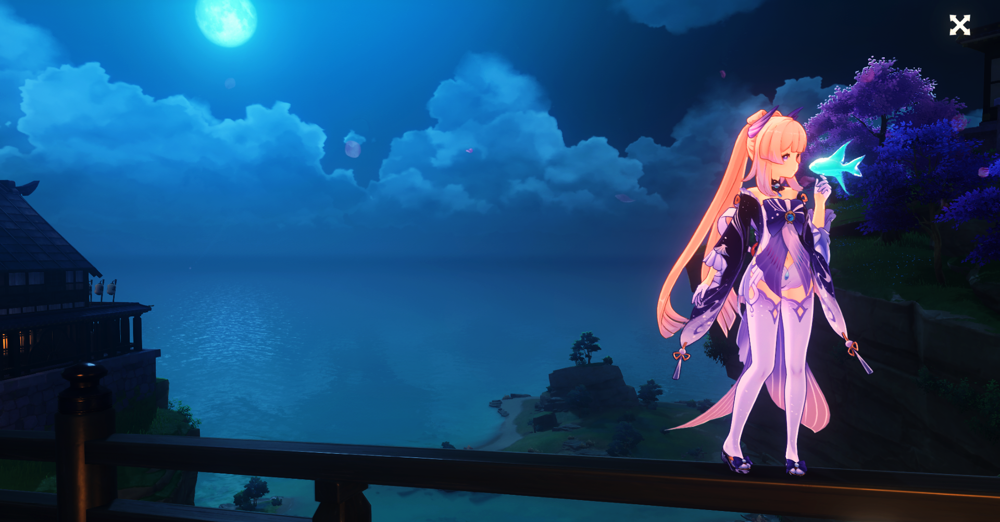
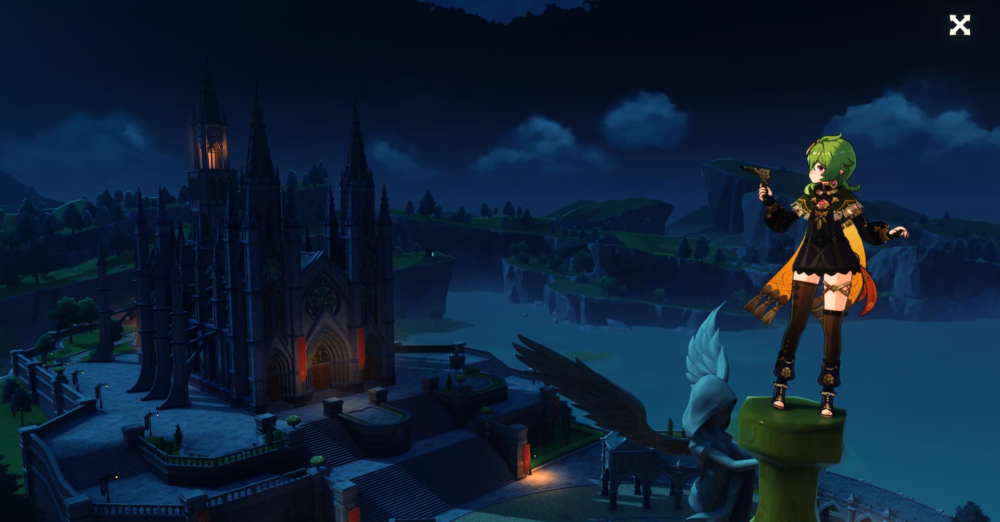

    <h1>🌟 Genshin Impact Stella Mod Pack - 2023 🌟</h1>
    

        
    

    
    
    
    
     
    
    
    
     
    <h3>
        🌠 » If you want Ray Tracing in game or  private DNS server, become <a href="https://www.patreon.com/sefinek" title="www.patreon.com/sefinek">my Patron</a> « 🌠 
        ⭐ » Star the repo if you liked it! « ⭐
    </h3>
    
    

## 
📋 » List

- [⚠️ Important](#important)
- [📂 Includes](#includes)
- [📃 Changelog](CHANGELOG.md)
- [✨ Requirements](#pc-requirements)
- [🔧 Supported systems](#supported-systems)
- [📥 How to install](#installation)
- [🛠️ Tested game versions](#tested-game-versions)
- [⚙️ Recommended settings for game](#settings-for-game)
- [📷 Other screenshots](#other-screenshots)
- [🧀 Legend](#legend)
- [🧶 Sources](#sources)

    
     
    
    

## 
⚠️ » Important

Please note that sharing any game screenshots that display your UID, visible shaders, or ReShade overlay can result in a ban in the game.
If you plan to record a video of the game for purposes such as uploading to YouTube or other platforms, make sure to hide or censor your UID and username to avoid a ban.

Additionally, we strongly recommend updating your graphics card and chipset drivers to ensure smooth gameplay and minimize any graphics-related issues or potential crashes.
Please familiarize yourself with the system requirements as well.

Furthermore, for more information and details regarding the Genshin Stella Mod project, you can check out our GitHub wiki.
It includes a comprehensive guide on how to install and use ReShade, as well as frequently asked questions and troubleshooting tips.

If you need further assistance, feel free to join our [Discord server](https://discord.gg/SVcbaRc7gH).
Additionally, if you wish to contribute to the project, please create a new [Pull request](https://github.com/sefinek24/Genshin-Impact-ReShade/pulls).
You can also check out the latest [screenshots](https://sefinek.net/genshin-impact-reshade/gallery?page=1) on our website and watch [videos](https://sefinek.net/genshin-impact-reshade/videos) on YouTube for more information.

Our main server of [sefinek.net](https://sefinek.net) is located in Poland, and [Cloudflare](https://www.cloudflare.com) servers are located in Warsaw and Frankfurt.

> By using this software, you agree to the terms of the [license agreement](LICENSE).
> In addition, we are not responsible for any potential bans in the game, although the chances of this happening are negligible.

## 
📂 » Includes

| 🔍 Name                   | 📃 More information                                                                                                                 | 🌍 URL address                                                  | 📑 License                                                                                 |
|:--------------------------|:------------------------------------------------------------------------------------------------------------------------------------|-----------------------------------------------------------------|:-------------------------------------------------------------------------------------------|
| Own launcher              | Always the latest releases.                                                                                                         | [Repository](https://github.com/sefinek24/genshin-mod-launcher) | [CC BY-NC-SA 4.0](https://github.com/sefinek24/genshin-mod-launcher/blob/main/LICENSE)     |
| Unlocked ReShade          | No depth buffer detection.                                                                                                          | [~~Repository~~](https://github.com/sefinek24/unlocked-reshade) | [BSD 3-Clause License](https://github.com/sefinek24/unlocked-reshade/blob/main/LICENSE.md) |
| Easy installation wizard  | Safe and automatic installation.                                                                                                    | [Repository](https://github.com/sefinek24/genshin-mod-setup)    | [CC BY-NC-SA 4.0](https://github.com/sefinek24/genshin-mod-setup)                          |
| FPS Unlocker              | [Click here for more information.](https://github.com/sefinek24/genshin-fps-unlock#genshin-impact-fps-unlocker-modified-by-sefinek) | [Repository](https://github.com/sefinek24/genshin-fps-unlock)   |                                                                                            |
| Always the latest shaders | The best experience.                                                                                                                | [Folder](data/reshade/shaders)                                  |                                                                                            |
| Own presets for game      | Best graphics quality.                                                                                                              | [Folder](data/presets)                                          | [CC BY-SA 4.0](data/presets/LICENSE)                                                       |
| Community presets         | Presets created by our community.                                                                                                   | [Folder](data/presets/Made%20by%20community)                    | [CC BY-SA 4.0](data/presets/LICENSE)                                                       |
| Preset with Ray Tracing   | Only available for Patrons.                                                                                                         | [Patreon](https://www.patreon.com/sefinek)                      |                                                                                            |
| Crosire's DLL injector    | Just an injector.                                                                                                                   | [Download file](data/reshade/inject64.exe)                      |                                                                                            |

## 
✨ » Requirements

> 📝 **Note:** Make sure your PC meets the following requirements before installing the mod.

| 💻 Your PC & Network Requirements          | 📂 Dependencies                                                                                                                                                                                                       |
|:-------------------------------------------|-----------------------------------------------------------------------------------------------------------------------------------------------------------------------------------------------------------------------|
| **OS:** Windows 10/11 (build > 19041)      | [Visual C++ 2015-2022 Redistributable](https://aka.ms/vs/17/release/vc_redist.x64.exe)                                                                                                                                |
| **CPU:** 64-bit processor and system       | [.NET Framework 4.8](https://dotnet.microsoft.com/en-us/download/dotnet-framework/thank-you/net48-web-installer)                                                                                                      |
| **GPU:** DirectX 11 support                | [.NET 7.0](https://dotnet.microsoft.com/en-us/download/dotnet/7.0) (Only for patrons)                                                                                                                                 |
| **Disk:** At least 1 GB of free disk space | [Windows Terminal](https://github.com/microsoft/terminal/releases)                                                                                                                                                    |
| **Network:** Good internet connection      | [Microsoft VCLibs](https://learn.microsoft.com/en-us/troubleshoot/developer/visualstudio/cpp/libraries/c-runtime-packages-desktop-bridge#how-to-install-and-update-desktop-framework-packages) (For Windows Terminal) |
| **BIOS:** UEFI mode enabled                | [Microsoft Edge WebView2 Runtime](https://developer.microsoft.com/en-us/microsoft-edge/webview2) (Optional)                                                                                                           |

## 
🔧 » Supported operating systems

| 💻 System       | 🔖 Version | 📝 OS Build   | 🙀 Status      | 🤔 Recommended? |
|-----------------|:-----------|---------------|:---------------|:----------------|
| Windows 11      | 22H2       | 22621.900     | [✔️](#legend)  | [❌](#legend)    |
| Windows 10      | 21H2       | 19044.2788    | [✔️](#legend)  | [️✔️](#legend)  | 
| Windows 8 / 8.1 |            | [❓](#legend)  | [🎯️](#legend) | [❌](#legend)    | 
| Windows 7       |            | [❓](#legend)  | [🎯️](#legend) | [❌](#legend)    | 
| Android / Linux |            | [❓](#legend)  | [❌](#legend)   | [❌](#legend)    | 
| iOS / macOS     |            | [❓](#legend)️ | [❌](#legend)   | [❌](#legend)    |

## 
📥 » How to install?

### 📦 Short tutorial (installation via setup)
1. Download the latest setup from [my official website](https://genshin.sefinek.net).
2. Extract the downloaded file to a convenient location on your computer.
3. Run the setup file `Genshin Impact Mod Setup.exe` and follow the on-screen instructions to install the mod.
4. After installing the mod, launch the Stella Launcher and click the `Start game` button.
5. Select the appropriate number of [frames per second](https://github.com/sefinek24/Genshin-Impact-ReShade/wiki/04.-What-is...#-considerations).

After a moment, the game should launch with [ReShade](https://github.com/sefinek24/Genshin-Impact-ReShade/wiki/04.-What-is...#-reshade) injected and [FPS Unlocker](https://github.com/sefinek24/Genshin-Impact-ReShade/wiki/04.-What-is...#-fps-unlocker).

### 📃 Extended tutorial (GitHub Wiki)
1. [Main page](https://github.com/sefinek24/Genshin-Impact-ReShade/wiki/05.-Installation)
2. [Automatic installation](https://github.com/sefinek24/Genshin-Impact-ReShade/wiki/05.-Installation#-automatic-installation)
3. [Manual installation](https://github.com/sefinek24/Genshin-Impact-ReShade/wiki/05.-Installation#-manually-installation)

### ✋ Suggestion
Kindly avoid downloading files from this repository, including any branches, as the current versions are still in the beta testing phase.
There is a high likelihood of the mod not functioning properly or encountering other problems.
It is strongly recommended that you opt for the installer instead, as it guarantees access to the stable and fully operational version of the mod.

### 📝 Note
After the installation is complete, you should open the Stella Launcher and start the game by clicking on the **Start game** button.
Once the game has launched, it is crucial to verify that [the recommended graphics settings](#settings-for-game) are configured correctly.
Then, adjust the settings according to the recommended values based on your system's capabilities.
This will help to ensure that the game runs smoothly and looks its best.

## 
🛠️ » Tested game versions

| 🎮 Game version | 😅 Works with mod? | 📆 Date tested   |
|-----------------|--------------------|------------------|
| v3.6.0          | [✔️](#legend)      | April 12, 2023   |
| v3.5.0          | [✔️](#legend)      | March 01, 2023   |
| v3.4.0          | [✔️](#legend)      | January 18, 2023 |
| v3.3.0          | [✔️](#legend)      | November 9, 2022 |
| v3.2.0          | [✔️](#legend)      | November 2, 2022 |
| v3.1.0          | [✔️](#legend)      | November 1, 2022 |

## 
⚙️ » Recommended settings for game

| 🔧 Settings                 | 📄 Value                         | 📄 Value                             |
|-----------------------------|----------------------------------|:-------------------------------------|
| **Specs**                   | Intel Core i3-10100 + GTX 1650   | AMD Ryzen 5 3600 + RTX 2060          |
|                             |                                  |                                      |
| **Display Mode**            | 1920x1080 (or higher) Fullscreen | 1920x1080 (or higher) Fullscreen     |
| **Brightness**              | Default                          | Default                              |
| **FPS**                     | 60                               | 60                                   |
| **Render Resolution**       | 1.0                              | 1.1 or higher                        |
| **Shadow Quality**          | Medium                           | Medium                               |
| **Visual Effects**          | Medium                           | High                                 |
| **SFX Quality**             | Medium                           | High                                 |
| **Environment Detail**      | Medium                           | High                                 |
| **Anti-Aliasing**           | FSR 2                            | SMAA (Use FSR 2 if you have low FPS) |
| **Volumetric Fog**          | On                               | On                                   |
| **Reflections**             | On                               | On                                   |
| **Motion Blur**             | Low or Off                       | Low or Off                           |
| **Bloom**                   | On                               | On                                   |
| **Crowd Density**           | High                             | High                                 |
| **Co-Op Teammates Effects** | On                               | On                                   |
| **Subsurface Scattering**   | High                             | High                                 |
| **Anisotropic Filtering**   | 4x                               | 16x                                  |

### 📝 Note
These recommended settings are provided as a general guideline and may vary based on individual player preferences and system specifications.
It is recommended that players adjust the settings accordingly to optimize their own experience.

### ⚠️ Warning
Do not change FPS settings in the game if you are using FPS unlock.

### ⚠️ Important
Please note that there is an additional graphics settings option available in the reshade overlay by changing presets.
You can adjust the presets from very low to very high, which will significantly impact the shadows in the game.

## 
📷 » Other screenshots (without Ray Tracing)

### ⚠️ Warning
It is worth noting that relying solely on the screenshots or videos provided may not necessarily provide the most accurate or up-to-date representation of the software or application.
This is because the presets, or default settings, are constantly being reviewed and refined by the developers to ensure optimal user experience and address any issues or bugs that may arise.

## 
🧀 » Legend

| 🐈 Emoji       | 🤔 Meaning            | 🐈 Emoji      | 🤔 Meaning         | 🐈 Emoji     | 🤔 Meaning   |
|----------------|-----------------------|:--------------|:-------------------|:-------------|:-------------|
| [✔️](#legend)  | Yes / Supported       | [❌](#legend)  | No / Not supported | [❓](#legend) | I don't know |
| [🎯️](#legend) | Default not supported | [🤔](#legend) | Not tested         |              |              |

## 
🧶 » Sources

Please note that the icons and stickers used in this project were obtained from different sources.

- The icons were sourced from <a href="https://icons8.com" target="_blank">Icons8</a> and <a href="https://www.flaticon.com" target="_blank">FlatIcon</a>, which offer a variety of high-quality icons in formats including PNG, SVG, and EPS.
- The stickers used in the project were obtained from <a href="https://stickers.wiki" target="_blank">stickers.wiki</a>, a website that provides a large collection of digital stickers.