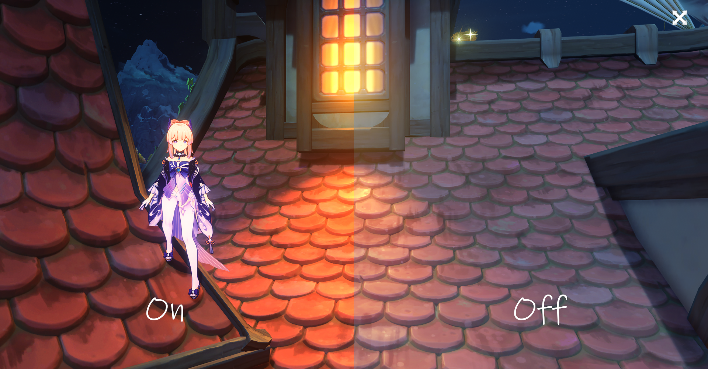
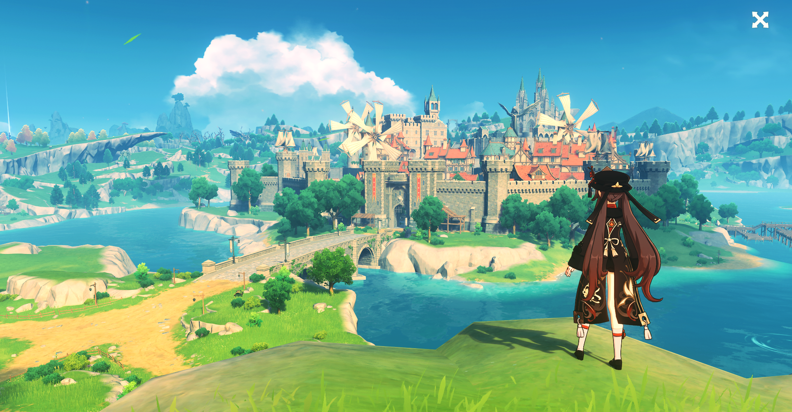
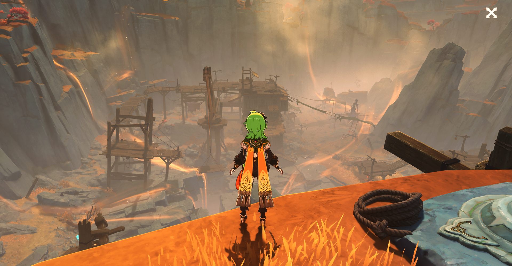
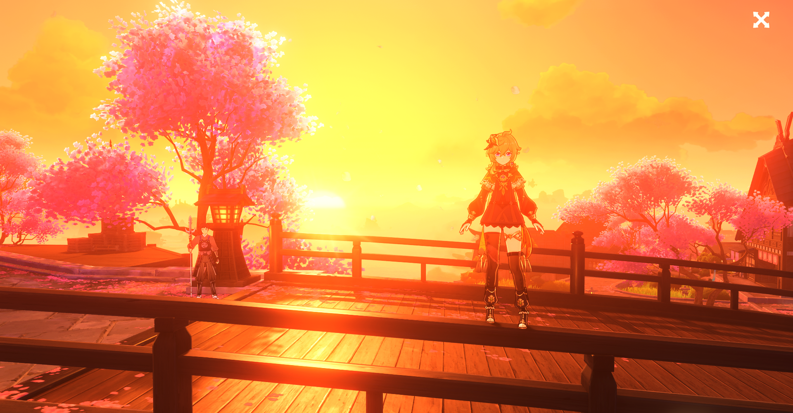

<h1>✨ Genshin Impact ReShade Mod Pack - 2023 ✨</h1>

## 📂 » Includes
- [FPS Unlocker](https://github.com/sefinek24/genshin-fps-unlock) [[More information]](https://github.com/sefinek24/genshin-fps-unlock#usage)
- [The best presets for game](Data/-%20Presets)

## 📝️ » Information
1. Make sure you have the [Microsoft Visual C++ 2019-2022 Redistributable (x64)](https://aka.ms/vs/17/release/vc_redist.x64.exe) and [.NET Framework 4.8](https://dotnet.microsoft.com/en-us/download/dotnet-framework/net48) installed. 
2. Remember to have the latest version of the modification!
3. Check the list of all versions [here](VERSIONS.md).

## 🎥 » Tutorial on YouTube (kinda outdated)
https://www.youtube.com/watch?v=rDeO26RapAk

## 🎮 » Gameplay
Soon...

## 🛠️ » Tested game versions
| Game version | It works? | Date       |
|--------------|-----------|------------|
| v3.2.0       | ✅         | 02.11.2022 |
| v3.1.0       | ✅         | 01.11.2022 |
> ✅ = Yes┃❎ = No┃🤔 = Not tested

## 🔧 » Supported operating systems
| System                        | OS Build   | Status |
|-------------------------------|------------|:-------|
| Windows 11 22H2 (recommended) | 22621.812  | ✅      |
| Windows 10 22H2               | 19045.2311 | ✅      | 
| Windows 8 / 8.1               | ❓          | 🤔     | 
| Windows 7                     | ❓          | 🤔     | 
> ✅ = Supported┃⚠️ = Not supported┃🤔 = Not tested┃❓= I don't know

## 🔧 » Recommended settings
| Settings               | Value                            | Settings                    | Value   |
|------------------------|----------------------------------|:----------------------------|:--------|
| **Graphics Quality**   | Custom                           | **Anti-Aliasing**           | SMAA    |
| **Display Mode**       | 1920x1080 (or higher) Fullscreen | **Volumetric Fog**          | On      | 
| **Brightness**         | Default                          | **Reflections**             | On      | 
| **FPS**                | 60                               | **Motion Blur**             | Extreme | 
| **Render Resolution**  | 1.0 or higher                    | **Bloom**                   | On      | 
| **Shadow Quality**     | High                             | **Crowd Density**           | High    | 
| **Visual Effects**     | High                             | **Co-Op Teammates Effects** | On      | 
| **SFX Quality**        | High                             | **Subsurface Scattering**   | High    | 
| **Environment Detail** | Highest                          | **Anisotropic Filtering**   | 16x     | 

## ⭐ » Thank you
Give a star if you can.

## 📷 » Other screenshots

## 🧶・Sources
Icons were taken from website <a href="https://icons8.com" target="_blank">Icons8</a>.