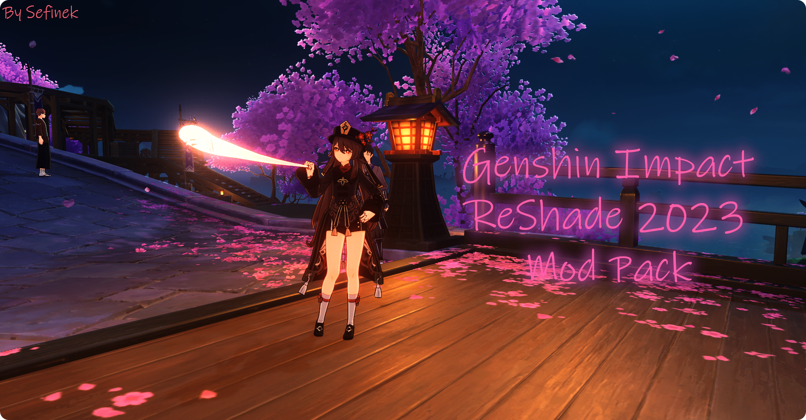
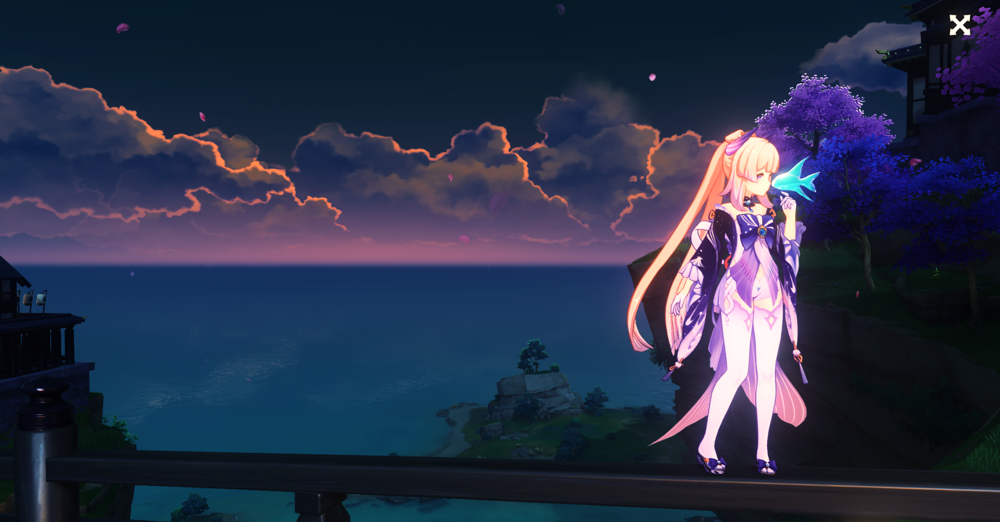

   <h1>✨ Genshin Impact ReShade Mod Pack - 2023 ✨</h1>
   

      
      
   

   

   <h2>⭐ » Star the repo if you liked it « ⭐</h2>
   
   
   
    
   

## 📂 » Includes
- Own launcher
- [Presets for game [Best graphics quality]](Data/-%20Presets)
- [FPS Unlocker](https://github.com/sefinek24/genshin-fps-unlock) [[More information]](https://github.com/sefinek24/genshin-fps-unlock#genshin-impact-fps-unlocker-modified-by-sefinek)

## 📥 » How to install?
Download the latest installer from [my official website](https://sefinek.net/genshin-impact-reshade).

## 🎥 » YouTube videos
Tutorial (kinda outdated): https://www.youtube.com/watch?v=rDeO26RapAk  
Watch new video about launcher: https://www.youtube.com/watch?v=NH8VXLZwBWg

## 🌠 » Main gallery (more screenshots)
https://sefinek.net/genshin-impact-reshade/gallery?page=1

## 📝️ » Notes and other information
1. Remember to have the latest version of the modification.
2. This mod requires:  
   • [Git](https://git-scm.com)  
   • [Visual C++ 2015-2022 Redistributable](https://aka.ms/vs/17/release/vc_redist.x64.exe)  
   • [.NET Framework 4.8](https://dotnet.microsoft.com/en-us/download/dotnet-framework/net48)  
   • [Windows Terminal from MS Store](https://apps.microsoft.com/store/detail/windows-terminal/9N0DX20HK701)  
   • [Microsoft Edge WebView2 Runtime](https://developer.microsoft.com/en-us/microsoft-edge/webview2) (Optional)
    > ✔ All dependencies will be installed automatically by the installer.
3. Gameplay will be available soon.
4. How to change branch? [`main` » `dev` or `dev` » `main`]  
   • Go to Tools  
   • Double-click on Collei's notebook

## 🛠️ » Tested game versions
| Game version | It works? | Date       |
|--------------|-----------|------------|
| v3.3.0       | ✅         | 09.11.2022 |
| v3.2.0       | ✅         | 02.11.2022 |
| v3.1.0       | ✅         | 01.11.2022 |
> ✅ = Yes ┃ ❎ = No ┃ 🤔 = Not tested

## 🔧 » Supported operating systems
| System                        | OS Build   | Status |
|-------------------------------|------------|:-------|
| Windows 11 22H2 (recommended) | 22621.900  | ✅      |
| Windows 10 22H2               | 19045.2364 | ✅      | 
| Windows 8 / 8.1               | ❓          | 🎯️    | 
| Windows 7                     | ❓️         | 🎯️    | 
> ✅ = Supported ┃ ⚠️ = Not supported ┃ 🎯️ = Default not supported  
> 🤔 = Not tested ┃ ❓ = I don't know

## ⚙ » Recommended settings for game
| Settings               | Value                              | Settings                    | Value                                |
|------------------------|------------------------------------|:----------------------------|:-------------------------------------|
| **Graphics Quality**   | Custom                             | **Anti-Aliasing**           | SMAA (Use FSR 2 if you have low FPS) |
| **Display Mode**       | 1920x1080 (or higher) Fullscreen   | **Volumetric Fog**          | On                                   | 
| **Brightness**         | Default                            | **Reflections**             | On                                   | 
| **FPS**                | 60 or higher (based on monitor Hz) | **Motion Blur**             | Extreme                              | 
| **Render Resolution**  | 1.1 or higher                      | **Bloom**                   | On                                   | 
| **Shadow Quality**     | High                               | **Crowd Density**           | High                                 | 
| **Visual Effects**     | High                               | **Co-Op Teammates Effects** | On                                   | 
| **SFX Quality**        | High                               | **Subsurface Scattering**   | High                                 | 
| **Environment Detail** | Highest                            | **Anisotropic Filtering**   | 16x                                  | 

## 📷 » Other screenshots

## 🧶 » Sources
Icons were taken from <a href="https://icons8.com" target="_blank">Icons8</a> and <a href="https://www.flaticon.com" target="_blank">FlatIcon</a>.