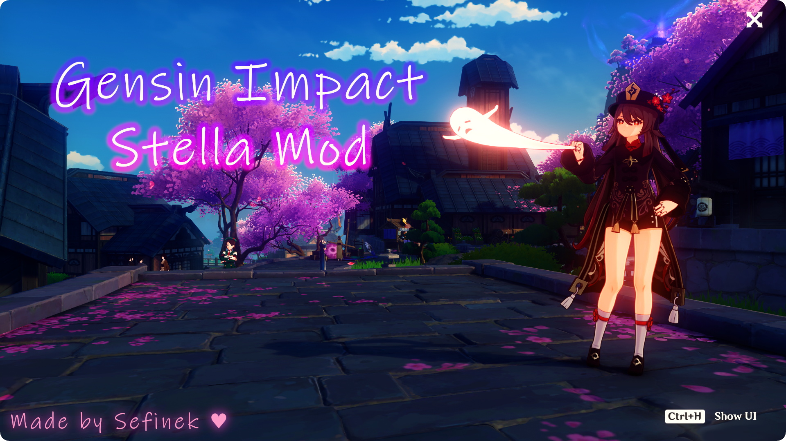

    <h1>🌟 Genshin Impact Stella Mod Pack 🌟</h1>
    

        
    

    
    
    
    
     
    
    
    
      
    
    <h3>
        🌠 » If you want to get Ray Tracing in game or other benefits, become <a href="https://www.patreon.com/sefinek" title="www.patreon.com/sefinek">my Patron</a> « 🌠 
        ⭐ » Star the repo if you liked it. Have a nice day or night! « ⭐
    </h3>
    
    

## 📋 〢 Table of contents
- [⚠️ Important](https://sefinek.net/genshin-impact-reshade/docs?page=readme#%E2%9A%A0%EF%B8%8F-%E3%80%A2-important)
- [📂 Includes](https://sefinek.net/genshin-impact-reshade/docs?page=readme#%F0%9F%93%82-%E3%80%A2-includes)
- [📃 Changelog](https://sefinek.net/genshin-impact-reshade/docs?page=changelog_v7)
- [✨ Requirements](https://sefinek.net/genshin-impact-reshade/docs?page=readme#%E2%9C%A8-%E3%80%A2-requirements)
- [🔧 Supported systems](https://sefinek.net/genshin-impact-reshade/docs?page=readme#%F0%9F%94%A7-%E3%80%A2-supported-operating-systems)
- [📥 How to install](https://sefinek.net/genshin-impact-reshade/docs?page=readme#%F0%9F%93%A5-%E3%80%A2-how-to-install)
- [🛠️ Tested game versions](https://sefinek.net/genshin-impact-reshade/docs?page=readme#div-idtested-game-versionsdiv-%F0%9F%9B%A0%EF%B8%8F-%E3%80%A2-tested-game-versions)
- [⚙️ Recommended settings for game](https://sefinek.net/genshin-impact-reshade/docs?page=readme#%F0%9F%9B%A0%EF%B8%8F-%E3%80%A2-tested-game-versions)
- [📷 Other screenshots](https://sefinek.net/genshin-impact-reshade/docs?page=readme#%E2%9A%99%EF%B8%8F-%E3%80%A2-recommended-settings-for-game)
- [🧀 Legend](https://sefinek.net/genshin-impact-reshade/docs?page=readme#%F0%9F%A7%80-%E3%80%A2-legend)
- [🧶 Sources](https://sefinek.net/genshin-impact-reshade/docs?page=readme#%F0%9F%A7%B6-%E3%80%A2-sources)

    
     
    
    

## ⚠️ 〢 Important
Please note that sharing game screenshots displaying your UID, visible shaders, or ReShade overlay may result in a game ban.
If you plan to record a video of the game for platforms like YouTube, remember to hide or censor your UID and username to avoid being banned.

Also, it is highly recommended to update your graphics card and chipset drivers to ensure smooth gameplay, minimize graphics-related issues, and prevent crashes.
Please familiarize yourself with the [system requirements](#pc-requirements) as well.

For more information and details about the Genshin Stella Mod project, visit our [GitHub Wiki](https://github.com/sefinek24/Genshin-Impact-ReShade/wiki).
The wiki provides a comprehensive installation and usage guide for ReShade, along with frequently asked questions and troubleshooting tips.

If you need further assistance, feel free to join our [Discord server](https://discord.gg/SVcbaRc7gH).
Additionally, if you wish to contribute to the project, please create a new [Pull request](https://github.com/sefinek24/Genshin-Impact-ReShade/pulls).
You can also check out the latest [screenshots](https://sefinek.net/genshin-impact-reshade/gallery?page=1) on our website and watch [YouTube videos](https://sefinek.net/genshin-impact-reshade/videos) for more.

The main server of [sefinek.net](https://sefinek.net) is located in Poland, while the [Cloudflare](https://www.cloudflare.com) servers that [Cloudflare Tunnel](https://www.cloudflare.com/products/tunnel) connects to are in Warsaw and Frankfurt.

> **Note**:  
> By using this software, you agree to the terms of the [License agreement](LICENSE), [Terms of use](https://github.com/sefinek24/Genshin-Impact-ReShade/wiki/05.-ToS#-1-terms-of-use) and [Rules](https://github.com/sefinek24/Genshin-Impact-ReShade/wiki/05.-ToS#-2-rules-etc).
> In addition, we are not responsible for any potential bans in the game, although the chances of this happening **are negligible**.

## 📂 〢 Includes
| 🔍 Name                   | 📃 More information                                                                                                          | 🌍 URL address                                                                                                                   | 📑 License                                                                                                     |
|:--------------------------|:-----------------------------------------------------------------------------------------------------------------------------|----------------------------------------------------------------------------------------------------------------------------------|:---------------------------------------------------------------------------------------------------------------|
| Own launcher              | Always the latest releases.                                                                                                  | [View folder](https://github.com/sefinek24/Genshin-Impact-ReShade/tree/main/Genshin%20Stella%20Mod)                              | [CC BY-NC-SA 4.0](LICENSE)                                                                                     |
| Easy installation wizard  | Safe and automatic installation.                                                                                             | [~~Repo~~](https://github.com/sefinek24/Stella-Mod-Setup) - deprecated                                                           | [CC BY-NC-SA 4.0](https://github.com/sefinek24/Stella-Mod-Setup)                                               |
| Unlocked ReShade          | No depth buffer detection.                                                                                                   | [~~Repo~~](https://github.com/sefinek24/unlocked-reshade) - deprecated                                                           | [BSD 3-Clause License](https://github.com/sefinek24/unlocked-reshade/blob/main/LICENSE.md)                     |
| Crosire's DLL injector    | Just an injector.                                                                                                            | [View file](https://github.com/sefinek24/Genshin-Impact-ReShade/blob/main/Genshin%20Stella%20Mod/data/reshade/inject64.exe)      |                                                                                                                |
| 3DMigoto                  | Custom mods in game.                                                                                                         | [View file](https://github.com/sefinek24/Genshin-Impact-ReShade/blob/main/Genshin%20Stella%20Mod/data/reshade/inject64.exe)      |                                                                                                                |
| FPS Unlocker              | [Click here for more info.](https://github.com/sefinek24/genshin-fps-unlock#genshin-impact-fps-unlocker-modified-by-sefinek) | [Repository](https://github.com/sefinek24/genshin-fps-unlock)                                                                    |                                                                                                                |
| Always the latest shaders | The best experience.                                                                                                         | [View folder](https://github.com/sefinek24/Stella-Mod-Resources/tree/main/static/reshade/zip/Shaders)                            |                                                                                                                |
| Own presets for game      | Best graphics quality.                                                                                                       | [View folder](https://github.com/sefinek24/Stella-Mod-Resources/tree/main/static/reshade/zip/Presets)                            | [CC BY-SA 4.0](https://github.com/sefinek24/Stella-Mod-Resources/blob/main/static/reshade/zip/Presets/LICENSE) |
| Community presets         | Presets created by our community.                                                                                            | [View folder](https://github.com/sefinek24/Stella-Mod-Resources/tree/main/static/reshade/zip/Presets/1.%20Made%20by%20community) | [CC BY-SA 4.0](https://github.com/sefinek24/Stella-Mod-Resources/blob/main/static/reshade/zip/Presets/LICENSE) |
| Presets with Ray Tracing  | Only available for [Patrons](https://www.patreon.com/sefinek).                                                               | [Patreon](https://www.patreon.com/sefinek)                                                                                       |                                                                                                                |

> **Note**:
> The repository with the resources is available here: [sefinek24/Stella-Mod-Resources](https://github.com/sefinek24/Stella-Mod-Resources)

## ✨ 〢 Requirements
> **Note**:
> Make sure your PC meets the following requirements before installing the mod.

| 🗝️ Your PC & Network                      | 📂 Dependencies                                                                                                                                                                                                       |
|:-------------------------------------------|-----------------------------------------------------------------------------------------------------------------------------------------------------------------------------------------------------------------------|
| **OS:** Windows 10.0 x64 (build > 19041)   | [Visual C++ 2015-2022 Redistributable](https://aka.ms/vs/17/release/vc_redist.x64.exe)                                                                                                                                |
| **CPU:** 64-bit processor and system       | [.NET Framework 4.8](https://dotnet.microsoft.com/en-us/download/dotnet-framework/thank-you/net48-web-installer)                                                                                                      |
| **GPU:** DirectX 11 support                | [.NET 7.0](https://dotnet.microsoft.com/en-us/download/dotnet/7.0) (Only for patrons)                                                                                                                                 |
| **Disk:** At least 1 GB of free disk space | [Windows Terminal](https://github.com/microsoft/terminal/releases)                                                                                                                                                    |
| **Network:** Good internet connection      | [Microsoft VCLibs](https://learn.microsoft.com/en-us/troubleshoot/developer/visualstudio/cpp/libraries/c-runtime-packages-desktop-bridge#how-to-install-and-update-desktop-framework-packages) (For Windows Terminal) |
| **BIOS:** UEFI mode enabled                | [Microsoft Edge WebView2 Runtime](https://developer.microsoft.com/en-us/microsoft-edge/webview2)                                                                                                                      |

## 🔧 〢 Supported operating systems
| 🌌 System       | 🔖 Version | 🙀 Status                                                                                                                                    | 🤔 Recommended?                                                                                                                              |
|-----------------|:-----------|:---------------------------------------------------------------------------------------------------------------------------------------------|:---------------------------------------------------------------------------------------------------------------------------------------------|
| Windows 11      | 22H2       | [✔️](https://sefinek.net/genshin-impact-reshade/docs?page=introduction#%F0%9F%98%89-explanation-of-the-meanings-of-emojis-used-in-the-wiki)  | [❌](https://sefinek.net/genshin-impact-reshade/docs?page=introduction#%F0%9F%98%89-explanation-of-the-meanings-of-emojis-used-in-the-wiki)   |
| Windows 10      | 21H2       | [✔️](https://sefinek.net/genshin-impact-reshade/docs?page=introduction#%F0%9F%98%89-explanation-of-the-meanings-of-emojis-used-in-the-wiki)  | [️✔️](https://sefinek.net/genshin-impact-reshade/docs?page=introduction#%F0%9F%98%89-explanation-of-the-meanings-of-emojis-used-in-the-wiki) | 
| Windows 8 / 8.1 |            | [🎯️](https://sefinek.net/genshin-impact-reshade/docs?page=introduction#%F0%9F%98%89-explanation-of-the-meanings-of-emojis-used-in-the-wiki) | [❌](https://sefinek.net/genshin-impact-reshade/docs?page=introduction#%F0%9F%98%89-explanation-of-the-meanings-of-emojis-used-in-the-wiki)   | 
| Windows 7       |            | [🎯️](https://sefinek.net/genshin-impact-reshade/docs?page=introduction#%F0%9F%98%89-explanation-of-the-meanings-of-emojis-used-in-the-wiki) | [❌](https://sefinek.net/genshin-impact-reshade/docs?page=introduction#%F0%9F%98%89-explanation-of-the-meanings-of-emojis-used-in-the-wiki)   | 
| Android / Linux |            | [❌](https://sefinek.net/genshin-impact-reshade/docs?page=introduction#%F0%9F%98%89-explanation-of-the-meanings-of-emojis-used-in-the-wiki)   | [❌](https://sefinek.net/genshin-impact-reshade/docs?page=introduction#%F0%9F%98%89-explanation-of-the-meanings-of-emojis-used-in-the-wiki)   | 
| iOS / macOS     |            | [❌](https://sefinek.net/genshin-impact-reshade/docs?page=introduction#%F0%9F%98%89-explanation-of-the-meanings-of-emojis-used-in-the-wiki)   | [❌](https://sefinek.net/genshin-impact-reshade/docs?page=introduction#%F0%9F%98%89-explanation-of-the-meanings-of-emojis-used-in-the-wiki)   |

## 📥 〢 How to install?
### 📦 » Short tutorial (installation via setup)
1. Download the latest setup from [my official website](https://genshin.sefinek.net).
2. Run the setup file `Stella-Mod-Setup.exe` and follow the on-screen instructions to install the mod.
3. After installing the mod, launch the Stella Launcher and click the `Start game` button.
4. Select the appropriate number of [frames per second](https://github.com/sefinek24/Genshin-Impact-ReShade/wiki/04.-What-is...#-considerations).
> After a moment, the game should launch with [ReShade](https://github.com/sefinek24/Genshin-Impact-ReShade/wiki/07.-Installation#%EF%B8%8F-installation-via-innosetup) injected and [FPS Unlocker](https://github.com/sefinek24/Genshin-Impact-ReShade/wiki/04.-What-is...#-fps-unlocker).

### 📘 » Extended tutorial (GitHub Wiki)
1. [Main page](https://github.com/sefinek24/Genshin-Impact-ReShade/wiki/07.-Installation)
2. [Automatic installation](https://github.com/sefinek24/Genshin-Impact-ReShade/wiki/07.-Installation#%EF%B8%8F-automatic-installation)

### 📝 » Note
After the installation is complete, you should open the Stella Launcher and start the game by clicking on the **Start game** button.
Once the game has launched, it is crucial to verify that [the recommended graphics settings](#settings-for-game) are configured correctly.
Then, adjust the settings according to the recommended values based on your system's capabilities. This will help to ensure that the game runs smoothly and looks its best.

## 🛠️ 〢 Tested game versions
| 😻 Stella version | 🎮 Game version | 💻 System                      | 📝 OS build | 😅 Status                                                                                                                                           | 📆 Date tested   |
|:------------------|-----------------|:-------------------------------|:------------|-----------------------------------------------------------------------------------------------------------------------------------------------------|------------------|
| v7.6.1.0          | v3.8.0.0        | Microsoft Windows 11 Home 22H2 | 22621.1992  | [✔️ Success](https://sefinek.net/genshin-impact-reshade/docs?page=introduction#%F0%9F%98%89-explanation-of-the-meanings-of-emojis-used-in-the-wiki) | July 31, 2023    |
| Unknown           | v3.8.0.0        | Microsoft Windows 10 Home 22H2 | 19045.3155  | [✔️ Success](https://sefinek.net/genshin-impact-reshade/docs?page=introduction#%F0%9F%98%89-explanation-of-the-meanings-of-emojis-used-in-the-wiki) | July 09, 2023    |
| Unknown           | v3.7.0.0        | Microsoft Windows 10 Home 22H2 | 19045.3031  | [✔️ Success](https://sefinek.net/genshin-impact-reshade/docs?page=introduction#%F0%9F%98%89-explanation-of-the-meanings-of-emojis-used-in-the-wiki) | May 24, 2023     |
| Unknown           | v3.6.0.0        |                                |             | [❌ Fail](https://sefinek.net/genshin-impact-reshade/docs?page=introduction#%F0%9F%98%89-explanation-of-the-meanings-of-emojis-used-in-the-wiki)     | April 12, 2023   |
| Unknown           | v3.5.0.0        |                                |             | [❌ Fail](https://sefinek.net/genshin-impact-reshade/docs?page=introduction#%F0%9F%98%89-explanation-of-the-meanings-of-emojis-used-in-the-wiki)     | March 01, 2023   |
| Unknown           | v3.4.0.0        |                                |             | [❌️ Fail](https://sefinek.net/genshin-impact-reshade/docs?page=introduction#%F0%9F%98%89-explanation-of-the-meanings-of-emojis-used-in-the-wiki)    | January 18, 2023 |
| Unknown           | v3.3.0.0        |                                |             | [❌ Fail](https://sefinek.net/genshin-impact-reshade/docs?page=introduction#%F0%9F%98%89-explanation-of-the-meanings-of-emojis-used-in-the-wiki)     | November 9, 2022 |
| Unknown           | v3.2.0.0        |                                |             | [❌ Fail](https://sefinek.net/genshin-impact-reshade/docs?page=introduction#%F0%9F%98%89-explanation-of-the-meanings-of-emojis-used-in-the-wiki)     | November 2, 2022 |
| Unknown           | v3.1.0.0        |                                |             | [❌ Fail](https://sefinek.net/genshin-impact-reshade/docs?page=introduction#%F0%9F%98%89-explanation-of-the-meanings-of-emojis-used-in-the-wiki)     | November 1, 2022 |

## ⚙️ 〢 Recommended settings for game
| 🔧 Settings                 | 💻 Intel Core i3-10100 + GTX 1650 | 💻 AMD Ryzen 5 3600 + RTX 2060       |
|-----------------------------|-----------------------------------|:-------------------------------------|
| **Display Mode**            | 1920x1080 (or higher) Fullscreen  | 1920x1080 (or higher) Fullscreen     |
| **Brightness**              | Default                           | Default                              |
| **FPS**                     | 60                                | 60                                   |
| **Render Resolution**       | 1.0                               | 1.1 or higher                        |
| **Shadow Quality**          | Medium                            | High                                 |
| **Visual Effects**          | Medium                            | High                                 |
| **SFX Quality**             | Medium                            | High                                 |
| **Environment Detail**      | Medium                            | High                                 |
| **Anti-Aliasing**           | FSR 2                             | SMAA (Use FSR 2 if you have low FPS) |
| **Volumetric Fog**          | On                                | On                                   |
| **Reflections**             | On                                | On                                   |
| **Motion Blur**             | Low or Off                        | Low or Off                           |
| **Bloom**                   | On                                | On                                   |
| **Crowd Density**           | High                              | High                                 |
| **Co-Op Teammates Effects** | On                                | On                                   |
| **Subsurface Scattering**   | High                              | High                                 |
| **Anisotropic Filtering**   | 4x                                | 16x                                  |

### 📝 » Note
These recommended settings are provided as a general guideline and may vary based on individual player preferences and system specifications.
It is recommended that players adjust the settings accordingly to optimize their own experience.

### ✋ » Important
Please note that there is an additional graphics settings option available in the reshade overlay by changing presets.
You can adjust the presets from very low to very high, which will significantly impact the shadows in the game.

### ⚠️ » Warning
Do not change FPS settings in the game if you are using FPS unlock.

## 📷 〢 Other screenshots (without Ray Tracing)

    
    
    

### ⚠️ Warning
It is worth noting that relying solely on the screenshots or videos provided may not necessarily provide the most accurate or up-to-date representation of the software or application.
This is because the presets or default settings are constantly being reviewed
and refined by the developers to ensure optimal user experience and address any issues or bugs that may arise.

##  🧀 〢 Legend
| 🐈 Emoji                                                                                                                                     | 🤔 Meaning            | 🐈 Emoji                                                                                                                                    | 🤔 Meaning         | 🐈 Emoji                                                                                                                                   | 🤔 Meaning   |
|----------------------------------------------------------------------------------------------------------------------------------------------|-----------------------|:--------------------------------------------------------------------------------------------------------------------------------------------|:-------------------|:-------------------------------------------------------------------------------------------------------------------------------------------|:-------------|
| [✔️](https://sefinek.net/genshin-impact-reshade/docs?page=introduction#%F0%9F%98%89-explanation-of-the-meanings-of-emojis-used-in-the-wiki)  | Yes / Supported       | [❌](https://sefinek.net/genshin-impact-reshade/docs?page=introduction#%F0%9F%98%89-explanation-of-the-meanings-of-emojis-used-in-the-wiki)  | No / Not supported | [❓](https://sefinek.net/genshin-impact-reshade/docs?page=introduction#%F0%9F%98%89-explanation-of-the-meanings-of-emojis-used-in-the-wiki) | I don't know |
| [🎯️](https://sefinek.net/genshin-impact-reshade/docs?page=introduction#%F0%9F%98%89-explanation-of-the-meanings-of-emojis-used-in-the-wiki) | Default not supported | [🤔](https://sefinek.net/genshin-impact-reshade/docs?page=introduction#%F0%9F%98%89-explanation-of-the-meanings-of-emojis-used-in-the-wiki) | Not tested         |                                                                                                                                            |              |

## 🧶 〢 Sources
Please note that the icons and stickers used in this project were obtained from different sources.

- The icons were sourced from <a href="https://icons8.com" target="_blank">Icons8</a> and <a href="https://www.flaticon.com" target="_blank">FlatIcon</a>, which offer a variety of high-quality icons in formats including PNG, SVG, and EPS.
- The stickers used in the project were obtained from <a href="https://stickers.wiki" target="_blank">stickers.wiki</a>, a website that provides a large collection of digital stickers.
